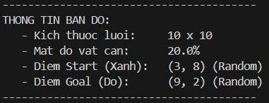
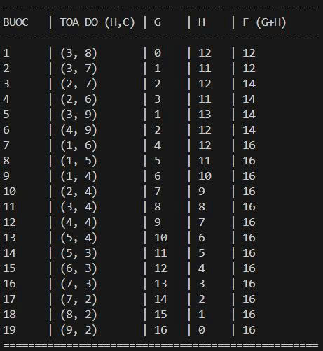
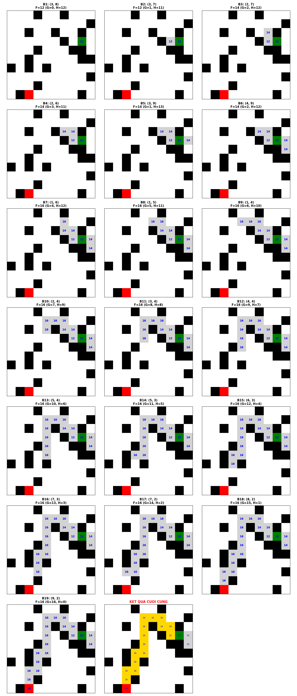

# Module A\*: Tìm kiếm đường đi ngắn nhất

Module này triển khai thuật toán \**A* (A-Star)\*\* để tìm đường đi ngắn nhất từ điểm bắt đầu đến điểm đích trên một lưới 2D có chứa vật cản.

## 1\. Cấu trúc thư mục & File

Dự án được tổ chức theo mô hình **Core - Helper - Main** (OOP) để đảm bảo tính tách biệt và dễ bảo trì:

  * **`main.py`**:
      * Điểm bắt đầu của chương trình.
      * Khởi tạo `AStarController` và kích hoạt luồng chạy chính.
  * **`helpers.py`**:
      * **Class `Node`**: Đại diện cho từng ô trên bản đồ (tọa độ, chi phí G, H, F, cha/con).
      * **Class `MazeMap`**: Quản lý lưới 2D, sinh vật cản ngẫu nhiên.
      * **Hàm `visualize...`**: Sử dụng `matplotlib` để vẽ lưới, vật cản và đường đi.
  * **`cores.py`**:
      * **Class `AStarSolver`**: "Bộ não" giải thuật. Chứa logic hàng đợi ưu tiên (Priority Queue) để tìm đường.
  * **`images/`**:
      * Thư mục tự động được tạo ra để lưu ảnh kết quả (`astar_result.png`) sau khi chạy.

## 2\. Tính năng

1.  **Tùy chỉnh linh hoạt**:
      * Kích thước lưới (Grid Size).
      * Mật độ vật cản (Obstacle Density).
      * Tọa độ điểm Bắt đầu (Start) và Đích (Goal).
2.  **Trực quan hóa**:
      * Hiển thị từng bước duyệt (Open/Closed set).
      * Vẽ đường đi ngắn nhất tìm được.
      * Xuất ảnh kết quả ra file `astar_result.png`.
3.  **An toàn**:
      * Tự động kiểm tra input hợp lệ.
      * Tự động tạo thư mục lưu ảnh nếu chưa tồn tại.

## 3\. Thuật toán & Cấu trúc dữ liệu

### 3.1. Nguyên lý A\*

Sử dụng hàm đánh giá $F(n) = G(n) + H(n)$ để chọn lối đi tối ưu:

  * **$G(n)$**: Chi phí thực tế từ điểm xuất phát đến node hiện tại.
  * **$H(n)$**: Chi phí ước lượng từ node hiện tại đến đích (Heuristic).
  * **$F(n)$**: Tổng chi phí dự kiến.

### 3.2. Hàm Heuristic

Sử dụng khoảng cách **Manhattan**: $|x_1 - x_2| + |y_1 - y_2|$ (phù hợp cho lưới di chuyển 4 hướng).

### 3.3. Chi tiết Cấu trúc dữ liệu (Bổ sung)
Chương trình sử dụng các cấu trúc dữ liệu sau để đảm bảo hiệu năng:

  * **Class `Node`**:

      * Lưu trữ tọa độ `(x, y)` và trạng thái vật cản (`is_obstacle`).
      * Lưu các giá trị chi phí `g`, `h`, `f` để so sánh.
      * Lưu biến `parent` để truy vết (backtrack) đường đi từ đích về nguồn sau khi tìm thấy.

  * **Open Set (Tập Mở)**:

      * Sử dụng **Priority Queue** (Hàng đợi ưu tiên - `heapq`).
      * **Cơ chế**: Luôn tự động đẩy node có giá trị **F nhỏ nhất** lên đầu để thuật toán xử lý trước.

  * **Closed Set (Tập Đóng)**:

      * Sử dụng **Set** (Hash Set) để lưu tọa độ các node đã đi qua.
      * **Cơ chế**: Giúp kiểm tra nhanh xem một ô đã được duyệt chưa, tránh việc thuật toán bị lặp vô tận.

## 4\. Yêu cầu cài đặt

Đảm bảo đã cài đặt các thư viện cần thiết:

```bash
pip install numpy matplotlib
```

## 5\. Hướng dẫn sử dụng

### Bước 1: Chạy chương trình

Mở terminal tại thư mục `module_astar` và chạy lệnh:

```bash
python main.py
```

### Bước 2: Cấu hình Input

Chương trình sẽ yêu cầu bạn nhập:

1.  **Kích thước N**: (Ví dụ: 20).
2.  **Mật độ vật cản**: (Ví dụ: 0.3).
3.  **Tọa độ Start/Goal**: Nhập `hàng,cột` hoặc nhấn Enter để Random.

### Bước 3: Xem kết quả

  * Chương trình in log từng bước duyệt ra màn hình.
  * Ảnh kết quả sẽ được lưu tại: `~/module_astar/images/astar_result.png`.


## Chạy chương trình demo
1. **Input**

    
2. **Output**

    



