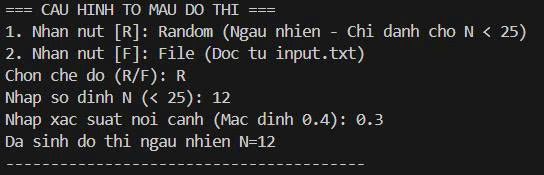
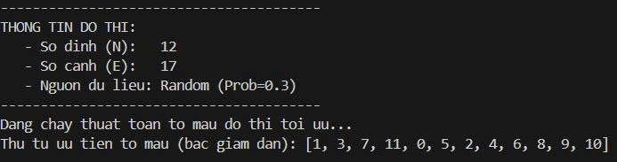
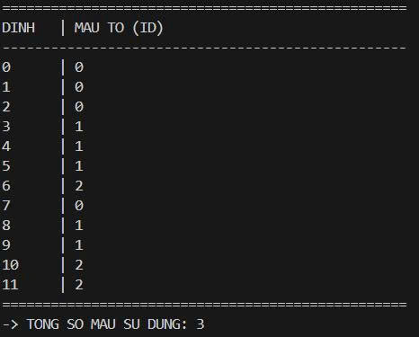
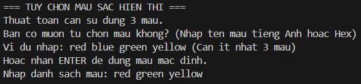
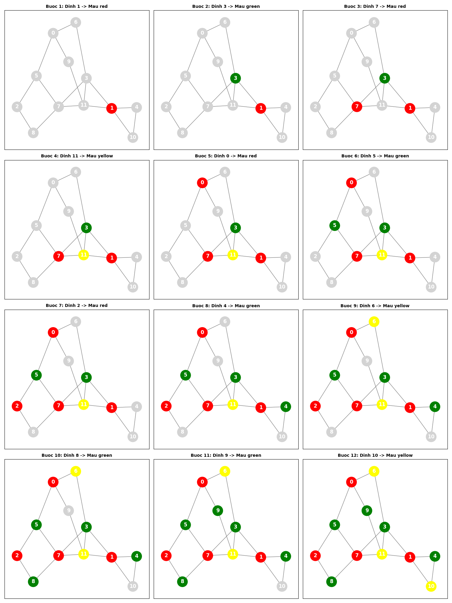

## Module 2: Tô màu Đồ thị (Graph Coloring)

Module này giải quyết bài toán tô màu các đỉnh của đồ thị sao cho không có hai đỉnh kề nhau nào cùng màu, sử dụng số lượng màu ít nhất có thể.

### 1\. Cấu trúc thư mục & File 

```
module_coloring/
├── cores.py       # Chứa thuật toán tô màu chính (Class OptimalColoringSolver)
├── helpers.py     # Chứa cấu trúc dữ liệu đồ thị, hàm vẽ hình và lưu ảnh
├── main.py        # File chạy chính (Entry point)
├── input.txt      # (Tùy chọn) File dữ liệu đồ thị đầu vào
└── images/        # Thư mục chứa ảnh kết quả (tự động tạo)
```

### 2\. Thuật toán & Cấu trúc Dữ liệu

#### 2.1. Cấu trúc Dữ liệu (Class `GraphMap`)

  * **Danh sách kề (Adjacency List)**: Sử dụng Dictionary `{node: [neighbors]}` để lưu trữ đồ thị. Giúp truy xuất các đỉnh kề nhanh chóng.
  * **Danh sách cạnh (Edge List)**: List các tuple `(u, v)` dùng để vẽ đồ thị bằng thư viện `networkx`.

#### 2.2. Chiến lược giải quyết (Greedy High-Degree First)

Thuật toán sử dụng phương pháp tham lam (Greedy) kết hợp heuristic bậc của đỉnh (Degree):

1.  **Tính bậc (Degree)**: Tính số lượng cạnh nối của mỗi đỉnh.
2.  **Sắp xếp**: Ưu tiên tô màu các đỉnh có **bậc cao nhất** trước. (Đỉnh bậc cao có nhiều ràng buộc nhất, nên xử lý sớm sẽ giúp giảm thiểu xung đột màu sau này).
3.  **Tô màu**: Duyệt qua danh sách đã sắp xếp, gán cho mỗi đỉnh màu có chỉ số nhỏ nhất ($0, 1, 2...$) mà chưa bị hàng xóm sử dụng.

### 3\. Tính năng 

  * **Lưu ảnh tự động**: Kết quả tô màu trực quan sẽ được lưu thành file `coloring_result.png` trong thư mục `images/`.
  * **Đa dạng đầu vào**: Hỗ trợ sinh đồ thị ngẫu nhiên hoặc đọc từ file `input.txt`.
  * **Tùy chỉnh màu sắc**: Người dùng có thể tự nhập bảng màu (palette) tùy thích.

### 4\. Hướng dẫn sử dụng

#### Bước 1: Cài đặt thư viện

```bash
pip install networkx matplotlib numpy
```

#### Bước 2: Chạy chương trình

Mở terminal tại thư mục `module_coloring` và chạy:

```bash
python main.py
```

#### Bước 3: Tương tác

  * Nhập `R` để sinh ngẫu nhiên hoặc `F` để đọc file.
  * Nhập thông số đồ thị (nếu chọn Random).
  * Xem kết quả in ra màn hình và kiểm tra file ảnh trong thư mục `images/`.

### Định dạng file `input.txt` (Dành cho chế độ File)

Nếu bạn muốn tự nhập đồ thị, hãy tạo file `input.txt` cùng thư mục với nội dung:

  * Dòng 1: Số nguyên $N$ (Số lượng đỉnh).
  * $N$ dòng tiếp theo: Ma trận kề ($N \times N$) gồm các số 0 và 1.

**Ví dụ input.txt:**

```text
4
0 1 1 0
1 0 1 0
1 1 0 1
0 0 1 0
```

## Chạy chương trình demo
1. **Input**

    
2. **Output**

    

    

    


